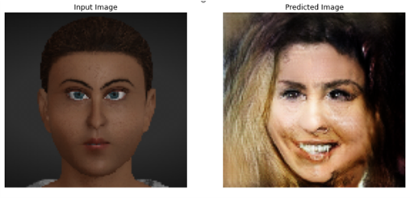
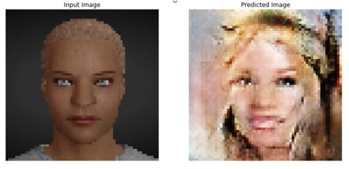
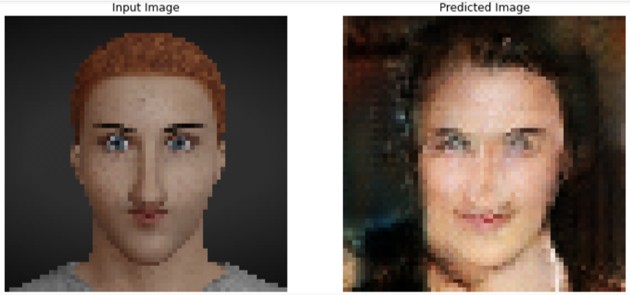
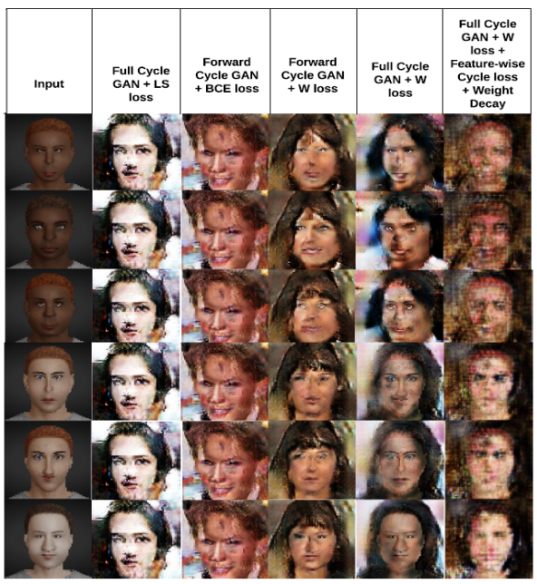
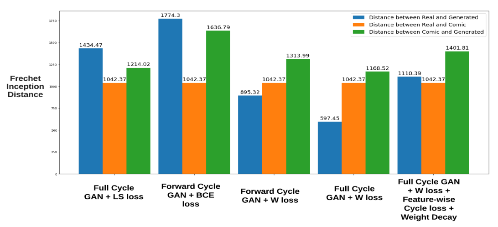

# Generating Controllable and Realistic Images by Unsupervised Image to Image Translation

Aims to perform image-to-image translation using unpaired datasets. In this work, a comic image has to be translated into a real celebrity image using GAn framework.
CycleGAN model is used as a baseline model, various experiments are conducted to do the ablation study of the baseline model for the given facemaker and CelebA datasets.
As a result, wasserstein loss is proposed to be used as an adversarial loss function which gives a satisfactory result. In addition, an attempt is made to improve the translation output by modified cycle loss (weight decay and feature based loss).

## Dependencies:

Install the following dependencies:

1. Python 3.6.
2. Tensorflow 2.2.
3. TensorFlow Addons 0.10.0.
4. OpenCV, scikit-image, tqdm, oyaml.

## Steps to run:

1. Clone this Repository.
2. Edit the output_dir variable in Main_CycleGAN_LS_loss.ipynb, Main_ForwardCycleGAN_BCE.ipynb, Main_ForwardCycleGAN_Wloss.ipynb, Main_CycleGAN_Wloss.ipynb, Main_CycleGAN_FeatureCycleLoss_WeightDecay.ipynb.
3. Give the dataset path of real and comic images in the variable dataset_real and dataset_comic respectively in Main_<config name>.ipynb.
4. Run any of the .ipynb file.

Once the steps are done the Checkpoints, Sample Training result and Sample Test result are stored in the output_dir that was given. The output of all the types of main file is stored in different folder with different name.

## Experiments:
  
```
  - Cycle GAN with ls loss (Baseline)
  - Cycle GAN forward with BCE loss (ablation study)
  - Cycle GAN forward with Wloss (ablation study)
  - Cycle GAN full(forward and backward) with Wloss (Our proposal)
  - Cycle GAN full(forward and backward) with Wloss, Weight decay, feature loss (our proposal)
  
 ```
  
## Results:

### Cycle GAN Forward with BCE loss

<p align="left">  </p>

### Cycle GAN Forward with Wasserstein loss
<p align="left">  </p>

### Cycle GAN with Wasserstein loss
<p align="left">  </p>

### Qualitative Comparison
<p align="left">  </p>
  
### Quantitative Evaluation
<p align="left">  </p>  

## Reference:
CycleGAN model is used as a baseline model : https://github.com/LynnHo/CycleGAN-Tensorflow-2.
  
  
#### Note
 
Already run .ipynb files are in the files - Main_CycleGAN_LS_loss_With_Output.ipynb, Main_ForwardCycleGAN_BCE_With_Output.ipynb, Main_ForwardCycleGAN_Wloss_With_Output.ipynb, Main_CycleGAN_Wloss_With_Output.ipynb, Main_CycleGAN_FeatureCycleLoss_WeightDecay_With_Output.ipynb.
